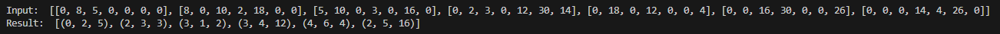

# CS 325 Analysis Of Algorithms

Finds the minimum spanning tree using Prim’s algorithm given a graph represented with an adjacency matrix.

## Assignment Info 

Implement Prims’ algorithm Name your function Prims(G). Include function in the file
MST.PY. Mention in your submission the input format and output format of your
program. 

Input: a graph represented as an adjacency matrix
For example, the graph in the Exploration would be represented as the below
(where index 0 is A, index 1 is B, etc.).

input = [\
 [0, 8, 5, 0, 0, 0, 0],\
 [8, 0, 10, 2, 18, 0, 0],\
 [5, 10, 0, 3, 0, 16, 0],\
 [0, 2, 3, 0, 12, 30, 14],\
 [0, 18, 0, 12, 0, 0, 4],\
 [0, 0, 16, 30, 0, 0, 26],\
 [0, 0, 0, 14, 4, 26, 0]\
]

Output: a list of tuples, wherein each tuple represents an edge of the MST as (v1, v2,
weight)
For example, the MST of the graph in the Exploration would be represented as the
below.

output = [(0, 2, 5), (2, 3, 3), (3, 1, 2), (3, 4, 12), (2, 5, 16), (4, 6, 4)]

Note: the order of edge tuples within the output does not matter; additionally, the
order of vertices within each edge does not matter. For example, another valid
output would be below (v1 and v2 in the first edge are flip-flopped; the last two
edges in the list are flip-flopped).

output = [(2, 0, 5), (2, 3, 3), (3, 1, 2), (3, 4, 12), (4, 6, 4), (2, 5, 16)]

## Output Example

inputArr = [\
 [0, 8, 5, 0, 0, 0, 0],\
 [8, 0, 10, 2, 18, 0, 0],\
 [5, 10, 0, 3, 0, 16, 0],\
 [0, 2, 3, 0, 12, 30, 14],\
 [0, 18, 0, 12, 0, 0, 4],\
 [0, 0, 16, 30, 0, 0, 26],\
 [0, 0, 0, 14, 4, 26, 0]\
]

  